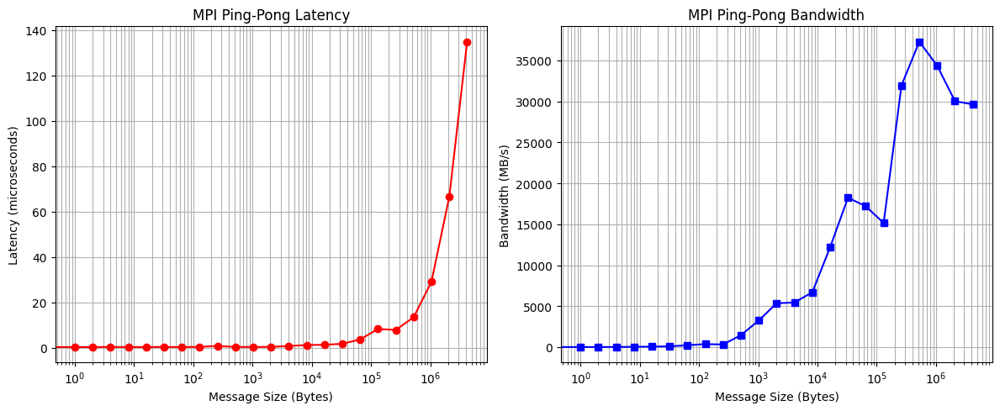

# Data
| Size (Bytes) | # Iterations | Total Time (s) | Latency (s) | Bandwidth (MB/s) |
|--------------|--------------|----------------|-------------|------------------|
| 0            | 10000        | 0.01049        | 0.000000524 | 0.00             |
| 1            | 10000        | 0.00524        | 0.000000262 | 3.64             |
| 2            | 10000        | 0.00527        | 0.000000264 | 7.23             |
| 4            | 10000        | 0.00640        | 0.000000320 | 11.93            |
| 8            | 10000        | 0.00529        | 0.000000265 | 28.84            |
| 16           | 10000        | 0.00559        | 0.000000279 | 54.61            |
| 32           | 10000        | 0.00644        | 0.000000322 | 94.76            |
| 64           | 10000        | 0.00544        | 0.000000272 | 224.31           |
| 128          | 10000        | 0.00673        | 0.000000337 | 362.55           |
| 256          | 10000        | 0.01544        | 0.000000772 | 316.35           |
| 512          | 10000        | 0.00669        | 0.000000334 | 1460.17          |
| 1024         | 10000        | 0.00599        | 0.000000300 | 3259.55          |
| 2048         | 10000        | 0.00730        | 0.000000365 | 5352.49          |
| 4096         | 10000        | 0.01435        | 0.000000717 | 5445.77          |
| 8192         | 10000        | 0.02332        | 0.000001166 | 6699.40          |
| 16384        | 10000        | 0.02562        | 0.000001281 | 12197.50         |
| 32768        | 10000        | 0.03425        | 0.000001713 | 18246.58         |
| 65536        | 10000        | 0.07270        | 0.000003635 | 17193.24         |
| 131072       | 10000        | 0.16498        | 0.000008249 | 15153.54         |
| 262144       | 10000        | 0.15645        | 0.000007823 | 31958.68         |
| 524288       | 10000        | 0.26803        | 0.000013402 | 37308.98         |
| 1048576      | 10000        | 0.58193        | 0.000029096 | 34368.45         |
| 2097152      | 10000        | 1.33181        | 0.000066590 | 30034.43         |
| 4194304      | 10000        | 2.69885        | 0.000134943 | 29642.21         |

# Graph 

